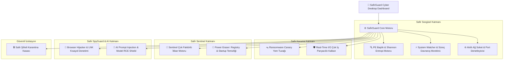

# 💎 SafirGuard — All-in-One Cyber Defense & Antivirus Suite

<div align="center">


<p align="center">
  <b>En gelişmiş siber güvenlik teknolojilerini Yapay Zeka (AI) Tehdit Kalkanı ile birleştiren; hem C# .NET 8 hem de Python FastAPI motorlarına sahip bütünleşik yeni nesil antivirüs ve siber güvenlik paketi.</b>
</p>

[✨ Özellikler](#-öne-çıkan-güvenlik-özellikleri) •
[🏛️ Mimari](#️-mimari-ve-savunma-katmanları) •
[📁 Dizin Yapısı](#-proje-dizin-yapısı) •
[🚀 Hızlı Başlangıç](#-hızlı-başlangıç) •
[📦 Bağımsız EXE](#-bağımsız-exe-ve-portable-sürüm) •
[🧪 Testler](#-birim-ve-entegrasyon-testleri) •
[👨‍💻 Geliştirici](#-geliştirici--iletişim)

</div>

---

## 🌟 Öne Çıkan Güvenlik Özellikleri

```
========================================================================================================
💎 SAFIRGUARD DÜNYA STANDARTLARINDA GÜVENLİK VE TEHDİT SAVUNMA MATRİSİ
========================================================================================================
  [✓] Safir Heuristic PE & Shannon Entropy Analyzer (UPX / Themida / VMP Obfuscation Tespiti)
  [✓] Safir System Watcher (Gizli Süreçler, Sahte svch0st.exe, Bellek Enjeksiyonu İzleme)
  [✓] Safir Anti-Ransomware Canary Trap (Masaüstü ve Belgelerde Nöbetçi Yem Dosyalar ile Anında Kilitleme)
  [✓] Safir Zero-Day Real-Time I/O Shield (Çok İş Parçacıklı Anlık Dosya Sistemi Kalkanı)
  [✓] Safir Sentinel Multi-Factor Reputation Engine (Çift Uzantı .pdf.exe ve Gölge Kopya İmha Engeli)
  [✓] Safir Power Eraser & Deep Persistence Cleaner (Windows Registry Run & Startup Kalıntı Temizliği)
  [✓] Safir SpyGuard & Browser Hijacker Shield (LNK Kısayol Yönlendirme & Web Miner Tespiti)
  [✓] 🤖 Safir AI Threat Shield (Prompt Injection, Jailbreak, Pickle RCE & Polimorfik Kod Tespiti)
  [✓] Safir Encrypted Vault (Byte-Maskelemeli .safir_locked Güvenli Karantina Kasası)
  [✓] Akıllı Ağ & Port Denetimi (Aktif TCP Bağlantıları, C2 Beaconing ve Port Güvenliği)
  [✓] Modern Cyberpunk Desktop Dashboard (ASP.NET Core Kestrel & Native WPF Dahili UI)
========================================================================================================
```

---

## 🤖 Yapay Zeka (AI) Saldırı Kalkanı

SafirGuard, geleneksel antivirüs yazılımlarının ötesine geçerek **yapay zeka çağının yeni nesil tehditlerini** nötralize eder:

1. **Prompt Injection & LLM Jailbreak Kalkanı**:
   - `Ignore previous instructions`, `DAN mode`, `Developer mode` gibi yerel/bulut LLM ajanlarını manipüle etmeye yönelik komutları engeller.
   - Görünmez Unicode (`Zero-Width Characters`) hilelerini ve steganografiyi anında tespit eder.
2. **Güvensiz Yapay Zeka Modelleri & Pickle RCE Tespiti**:
   - PyTorch (`.pt`, `.bin`), ONNX ve Pickle model dosyaları içine gizlenmiş `os.system`, `subprocess.Popen`, `eval` kancalarını tespit ederek uzaktan kod yürütülmesini engeller.
3. **Yapay Zeka Üretimi Polimorfik Kod Analizi**:
   - LLM'ler tarafından dinamik üretilmiş değişken kabuk kodlarını (shellcode) sezgisel yakalar.

---

## 🏛️ Mimari ve Savunma Katmanları



---

## 📁 Proje Dizin Yapısı

```
SafirGuard/
├── BAŞLAT_SAFIRGUARD_CSHARP.bat         # C# .NET SafirGuard tek tıkla başlatıcı
├── BAŞLAT_SAFIRGUARD_PYTHON.bat         # Python SafirGuard FastAPI tek tıkla başlatıcı
├── DERLE_VE_PAKETLE.bat                 # Tek tıkla tüm sürümleri derleyip paketleyen script
├── TESTLERI_CALISTIR.bat                # Hem .NET hem Python testlerini koşturan script
├── GITHUB_YUKLE.bat                     # GitHub deposuna tek tıkla yükleme aracı
├── README.md                            # Kapsamlı proje dokümantasyonu
├── LICENSE                              # MIT Lisansı
├── .gitignore                           # Git yoksayma kuralları
│
├── SafirGuard_CSharp/                   # C# .NET 8/10 Kaynak Kodları
│   ├── SafirGuard.slnx                  # .NET Solution Dosyası
│   ├── src/SafirGuard.App/              # ASP.NET Core Kestrel + WPF Native Window
│   └── tests/SafirGuard.Tests/          # Güvenlik Motorları xUnit Birim Testleri
│
├── SafirGuard_Python/                   # Python FastAPI Kaynak Kodları
│   ├── safir_guard/                     # Motorlar, izleme, karantina ve UI modülleri
│   ├── tests/                           # Python birim testleri
│   ├── run_safir.py                     # Python giriş noktası
│   └── requirements.txt                 # Python bağımlılıkları
│
└── Portable/                            # Kurulumsuz Taşınabilir Paketler
```

---

## 🧪 Birim ve Entegrasyon Testleri

Tüm güvenlik ve motor testlerini tek seferde koşturmak için:

```powershell
.\TESTLERI_CALISTIR.bat
```

### Test Sonuçları:
```
[✓] C# .NET xUnit Testleri : 7/7 Başarılı (%100 Başarı)
    • Test01: İmza ve Hash Eşleştirme Motoru
    • Test02: Safir PE Shannon Entropi Hesaplama
    • Test03: Safir Sentinel Çift Uzantı (.pdf.exe) Engelleme
    • Test04: Safir SpyGuard Reklam Enjektör ve Takip Tespiti
    • Test05: Safir Karantina Kasası İzolasyon ve Geri Yükleme
    • Test06: Yapay Zeka Prompt Injection & Jailbreak Tespiti
    • Test07: Yapay Zeka Pickle RCE Model Güvenlik Tespiti

[✓] Python unittest Testleri : 5/5 Başarılı (%100 Başarı)
    • Test01: Standart Test İmzası Tespiti
    • Test02: SpyGuard ve Takipçi Tespiti
    • Test03: Sezgisel PowerShell Script Tespiti
    • Test04: Karantina İzolasyon ve Geri Yükleme
    • Test05: Windows Başlangıç ve Kayıt Defteri Denetimi
```

---

## 👨‍💻 Geliştirici & İletişim

* **Geliştirici**: Cebrail Kara
* **Web Sitesi**: [www.safirsuite.com.tr](https://www.safirsuite.com.tr)
* **E-Posta**: [info@safirsuite.com.tr](mailto:info@safirsuite.com.tr) • [info@benimyaverim.com.tr](mailto:info@benimyaverim.com.tr)
* **Ekosistem**: SafirSuite & Benim Yaverim Yazılım Teknolojileri

---

## 📜 Lisans

Bu proje [MIT Lisansı](LICENSE) kapsamında açık kaynak olarak yayınlanmıştır.
© 2026 Cebrail Kara — SafirSuite. Tüm hakları saklıdır.
